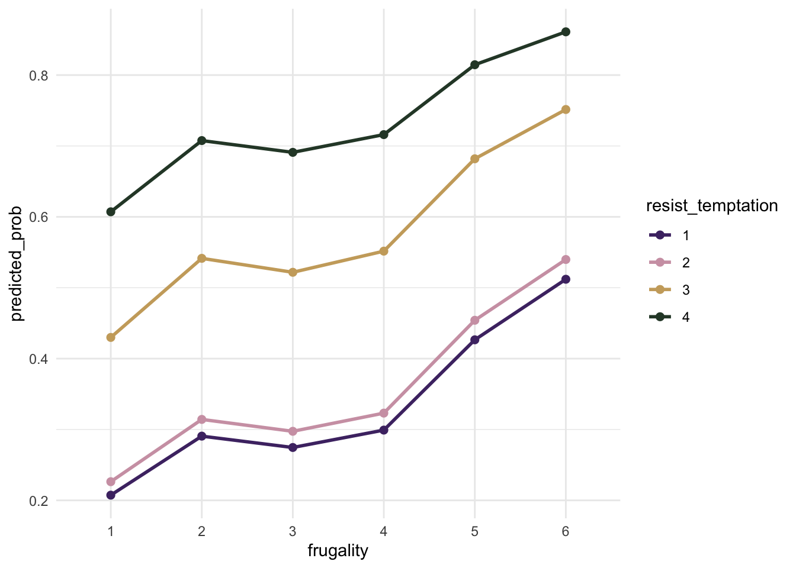

# Spending Habits Analysis & Prediction

This project explores how psychological and behavioral traits relate to self-reported control over spending habits. Using data from the National Financial Well-Being Survey, I used stepwise selection on a binary logistic regression model to identify the strongest predictors of perceived financial discipline.

The final model (selected via BIC) highlighted **frugality** and the **ability to resist temptation** as the top predictors. Other relevant factors included follow-through on financial commitments, impulsivity, and confidence in achieving financial goals.

### Tools Used

-   R
-   Quarto

### Key Packages

-   `tidyverse`
-   `broom`
-   `car`
-   `MASS`
-   `ggplot2`

### Visual Example

\
*Predicted probabilities of excellent spending habits by frugality and resistance to temptation.*

### Roadmap

-   [x]  Conduct primary analysis
-   [x]  Create an interactive visialization tool with Shiny
-   [ ]  Implement a classification tool using machine learning (e.g., random forest or boosted trees)

------------------------------------------------------------------------

This project began as a regression assignment and evolved into a meaningful exploration of behavior, modeling, and my own learning curve.
